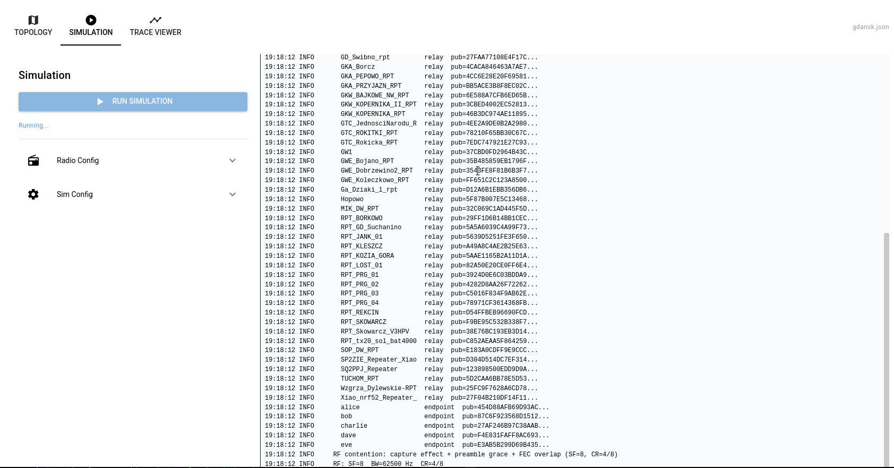
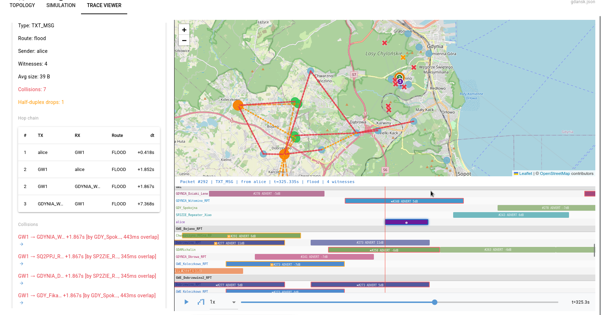

Moving away from this approach - as it is TOO slow, soon a full C++ implementation to be presented - with different approach.

# meshcore_sim

Fork from wonderfull job of Matthew - [Original Reop](https://github.com/matthewdgreen/meshcore_sim) 
focused on **realistic timing and collision modelling** 

I put attention to make radio as much realistic as possible - through - 
- SF-aware simulation
- Half-duplex corrections - collision detection
- Band-width aware
- Missing ACK and PATH
- More realistic timing and collision detection
- Node binary connected to simulated radio in missing touch points (e.g. missing retry, duty cycle, tx airtime.
- Listen before TX
- Realistic Advert
- SNR reception model implemented (in topology we define SNR; RSSI is derived as SNR + noise_floor)
- ...
More details in attached documentation.




---

A simulator for [MeshCore](https://github.com/meshcore-dev/MeshCore) mesh
networks.  Each simulated node runs the **real MeshCore C++ routing and
cryptography code** as a standalone subprocess; a Python orchestrator connects
them over simulated radio links with configurable loss, latency, SNR,
RF collisions, and adversarial behaviour.

[What changed vs upstream](#what-changed-vs-upstream) below.

```
alice ──(loss 5%, 20 ms)── relay1 ──(loss 5%, 20 ms)── bob
```
```
$ python3 -m orchestrator topologies/linear_three.json --duration 30 --seed 42
…
  Message delivery: 4/4 (100.0%)
  Latency (send->recv): min=21ms  avg=21ms  max=22ms
```

---

## Quick start

```sh
# 1. Clone with submodule
git clone --recurse-submodules https://github.com/stachuman/meshcore_sim.git
cd meshcore_sim

# 2. Build the C++ node agent
cd node_agent
cmake -S . -B build -DCMAKE_BUILD_TYPE=Release
cmake --build build
cd ..

# 3. Run a simulation
python3 -m orchestrator topologies/linear_three.json --duration 30 --seed 42

# 4. Run with the visual workbench (requires: pip install nicegui)
python3 -m workbench topologies/boston_relays.json
```

### Prerequisites

| Requirement | Version | Notes |
|-------------|---------|-------|
| C++17 compiler | GCC 12+ or AppleClang 17+ | For `node_agent` |
| CMake | >= 3.16 | |
| OpenSSL | 3.x | Usually pre-installed on Linux |
| Python | 3.9+ | Orchestrator uses only stdlib |

Optional: `pip install -r requirements.txt` for the workbench (NiceGUI) and
the legacy Dash visualiser.

If cloned without `--recurse-submodules`, initialise MeshCore with:

```sh
git submodule update --init
```

---

## How the simulation works

Each node is a separate OS process running the `node_agent` binary, which
links directly against the unmodified MeshCore C++ source.  Thin shims
replace the hardware radio, clock, and RNG with simulation-friendly versions:

- **SimRadio** — `recvRaw()` pops from a queue fed by the orchestrator;
  `startSendRaw()` emits JSON to stdout; `isSendComplete()` waits for the
  real LoRa airtime to elapse (Semtech AN1200.13 formula).
- **SimNode** — inherits `BaseChatMesh`, running real MeshCore ACK tracking,
  retry logic, contact management, path exchange, and duty-cycle enforcement.
- **SimClock** — wall-clock backed millisecond + RTC clocks.
- **SimRNG** — deterministic xoshiro256** PRNG seeded per node.

The Python orchestrator acts as the physical world:

1. Delivers packets between nodes based on the topology graph.
2. Applies per-link loss, propagation delay, and adversarial filters.
3. Computes LoRa airtime and delays delivery until TX completes.
4. Detects RF collisions (overlapping TX windows at shared receivers).
5. Enforces half-duplex (drops packets arriving at a transmitting node).
6. Applies the LoRa capture effect when lat/lon positions are available.
7. Generates traffic (advertisement floods + Poisson random text messages + public group channel messages).
8. Collects metrics: delivery rate, latency, collisions, ACK outcomes,
   per-packet path traces, and privacy exposure (witness counts).

For the full technical reference, see **[SIMULATION.md](SIMULATION.md)**.

---

## Running simulations

### Command line

```sh
python3 -m orchestrator <topology.json> [options]
```

Key options:

| Flag | Description |
|------|-------------|
| `--duration SECS` | Traffic duration (on top of warmup) |
| `--warmup SECS` | Time before traffic starts (auto-derived if omitted) |
| `--traffic-interval SECS` | Mean seconds between random text sends |
| `--seed N` | RNG seed for reproducibility |
| `--trace-out FILE` | Write packet trace JSON (for workbench) |
| `--agent PATH` | Override node binary (e.g. `privatemesh/build/privatemesh_agent`) |
| `--log-level` | `debug` / `info` / `warning` / `error` |

See **[EXAMPLES.md](EXAMPLES.md)** for worked scenarios with expected output.

### Visual workbench

The NiceGUI workbench provides topology editing, simulation launch, and
interactive trace replay in a browser.

```sh
pip install nicegui                                          # one-time
python3 -m workbench topologies/boston_relays.json            # opens browser
python3 -m workbench topologies/boston_relays.json --port 8090
```

Features:
- Map-based topology viewer (OpenStreetMap) with node/edge detail panels.
- Interactive topology editor (add/remove/move nodes and edges).
- One-click simulation launch with live log streaming.
- Packet trace replay with step-through, play/pause, and broadcast animation.
- Clickable cross-references between packets, nodes, and edges.

---

## What changed vs upstream

This fork diverges from the
[original simulator](https://github.com/matthewdgreen/meshcore_sim) in
several significant ways.  The original was designed for deterministic,
fast simulation by skipping radio timing and randomness.  This fork restores
those mechanisms to model real MeshCore behaviour.

### SimNode inherits BaseChatMesh (not just Mesh)

The original `SimNode` reimplemented ACK tracking, retry logic, and contact
management in Python.  This fork makes `SimNode` inherit from MeshCore's
`BaseChatMesh` class, so the **real C++ code** runs for:

- ACK tracking and CRC matching (`processAck()`)
- Message retry (up to 3 attempts via `onSendTimeout()`)
- Flood/direct timeout calculation (`calcFloodTimeoutMillisFor()`)
- Contact management (32-slot array with ECDH shared secrets)
- Path exchange (flood out, direct back)
- Duty-cycle enforcement (Dispatcher token-bucket)

### Real radio timing

`SimRadio::isSendComplete()` blocks for the actual LoRa airtime computed
from SF, BW, CR, and payload length (Semtech AN1200.13).  This enables:

- Realistic Dispatcher duty-cycle enforcement.
- Real retransmit delay jitter (`getRetransmitDelay()` runs unmodified).
- Correct `packetScore()` using SF-dependent SNR thresholds (matching
  `RadioLibWrapper::packetScoreInt()` from MeshCore).

### RF collision model

The orchestrator tracks all active TX windows and detects collisions:

- **Temporal overlap** — two transmissions whose airtime windows overlap.
- **Spatial reachability** — the interferer must be a radio neighbour of
  the receiver.
- **Capture effect** — when lat/lon positions are available, a signal that
  is >= 6 dB stronger than the interferer survives (log-distance path loss).
- **Half-duplex enforcement** — packets arriving at a node that is currently
  transmitting are dropped by the orchestrator before reaching the node.

### Deterministic per-node PRNG

`SimRNG` uses xoshiro256** seeded from the node's name or private key,
ensuring unique but reproducible identities.  The original seeded all nodes
identically when no private key was provided, causing identity collisions.

### Radio parameters threaded end-to-end

The topology JSON `radio` section (SF, BW, CR) is passed to each node agent
via CLI flags, so both the C++ airtime formula and the Python orchestrator
use consistent parameters.

### Additional fixes

- **ODR violation** in SimNode.h include path (commit `aeb60a0`).
- **Airtime formula** replaced: old formula (`len * 125ms`) gave wildly
  wrong results (5000 ms for 40 bytes); now uses Semtech AN1200.13 (~443 ms
  at EU Narrow for 40 bytes).

---

## Repository layout

```
meshcore_sim/
├── MeshCore/               Git submodule (upstream, unmodified)
├── node_agent/             C++ node process (SimRadio, SimNode, SimClock, SimRNG)
├── orchestrator/           Python simulation engine
├── workbench/              NiceGUI visual workbench
├── sim_tests/              Python test suite (402 tests)
├── tests/                  C++ test suite (45 tests)
├── topologies/             Example topology JSON files
├── tools/                  Topology import utilities
├── privatemesh/            Privacy-protocol experiments (separate binary)
├── experiments/            Automated experiment runner
├── demo/                   Interactive demos (room server)
└── viz/                    Legacy Dash visualiser
```

---

## Running tests

```sh
python3 -m sim_tests                    # all 402 tests (C++ + Python)
python3 -m sim_tests sim_tests.test_config   # single module
```

C++ tests separately:

```sh
cd tests && cmake -S . -B build && cmake --build build && ./build/meshcore_tests
# Expected: 45 passed, 0 failed (107 checks)
```

Integration tests are automatically **skipped** (not failed) when the
`node_agent` binary is not built.

---

## Documentation

| Document | Contents |
|----------|----------|
| **[SIMULATION.md](SIMULATION.md)** | Full technical reference: architecture, components, RF model, lifecycle, what's real vs simulated, known limitations |
| **[MISSING_FEATURES.md](MISSING_FEATURES.md)** | Feature gap analysis: what MeshCore features are/aren't simulated, with priority assessment and CR coding-gain analysis |
| **[EXAMPLES.md](EXAMPLES.md)** | Worked example simulations with commands and expected output |
| **[PROPOSAL_AUTOTUNE.md](PROPOSAL_AUTOTUNE.md)** | Proposal for exercising density-adaptive delay tuning |
| **[QUICKSTART_COLLISIONS.md](QUICKSTART_COLLISIONS.md)** | Quick start for collision-avoidance experiments |
| **[node_agent/README.md](node_agent/README.md)** | C++ build instructions, wire protocol reference |
| **[tools/README.md](tools/README.md)** | Topology import tools (live map scraping, optimizer conversion) |
| **[privatemesh/README.md](privatemesh/README.md)** | Privacy experiment binary and methodology |

---

## Topology file format

A topology JSON has four sections: `nodes`, `edges`, `simulation`, and
an optional `radio` section.

### Minimal example

```json
{
  "nodes": [
    { "name": "alice",  "relay": false },
    { "name": "relay1", "relay": true  },
    { "name": "bob",    "relay": false }
  ],
  "edges": [
    { "a": "alice",  "b": "relay1", "loss": 0.05, "latency_ms": 20 },
    { "a": "relay1", "b": "bob",    "loss": 0.05, "latency_ms": 20 }
  ],
  "simulation": {
    "warmup_secs": 5,
    "duration_secs": 60,
    "default_binary": "./node_agent/build/node_agent"
  },
  "radio": { "sf": 8, "bw_hz": 62500, "cr": 4 }
}
```

### Node fields

| Field | Type | Default | Description |
|-------|------|---------|-------------|
| `name` | string | **required** | Unique node identifier |
| `relay` | bool | `false` | Forward flood packets to neighbours |
| `room_server` | bool | `false` | Re-broadcast received messages to all contacts |
| `lat`, `lon` | float | -- | WGS-84 coordinates (enables capture effect + map view) |
| `prv_key` | string | -- | Fixed Ed25519 private key (128 hex chars) |
| `adversarial` | object | -- | `{"mode": "drop|corrupt|replay", "probability": 0.5}` |

### Edge fields

| Field | Type | Default | Description |
|-------|------|---------|-------------|
| `a`, `b` | string | **required** | Connected node names |
| `loss` | float | `0.0` | Packet loss probability [0-1] |
| `latency_ms` | float | `0.0` | One-way propagation delay (ms) |
| `snr` | float | `6.0` | Signal-to-noise ratio (dB) |
| `a_to_b`, `b_to_a` | object | -- | Per-direction overrides for asymmetric links |

### Radio section

| Field | Type | Default | Description |
|-------|------|---------|-------------|
| `sf` | int | `10` | Spreading factor (7-12) |
| `bw_hz` | int | `250000` | Bandwidth in Hz |
| `cr` | int | `1` | Coding-rate offset (1=CR4/5 ... 4=CR4/8) |
| `preamble_symbols` | int | `8` | Preamble symbols |
| `noise_floor_dBm` | float | `-120.0` | Noise floor for RSSI derivation (RSSI = SNR + noise_floor) |

---

## Importing real network topologies

```sh
# From a live meshcore-mqtt-live-map instance
python3 tools/fetch_topology.py --token <TOKEN> --only-relays \
    --min-edge-count 5 --output topologies/boston_relays.json

# From meshcore-optimizer output
python3 tools/import_topology.py ../meshcore-optimizer/topology.json \
    --output topologies/gdansk.json
```

See **[tools/README.md](tools/README.md)** for full reference.

---

## Generating grid topologies

```sh
python3 topologies/gen_grid.py 5 5 --loss 0.01 --latency 10 -o grid_5x5.json
```

Corner nodes are endpoints; all others are relays.  Useful for controlled
multi-hop routing experiments.
